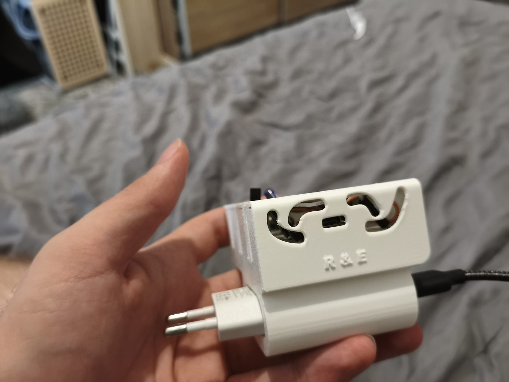
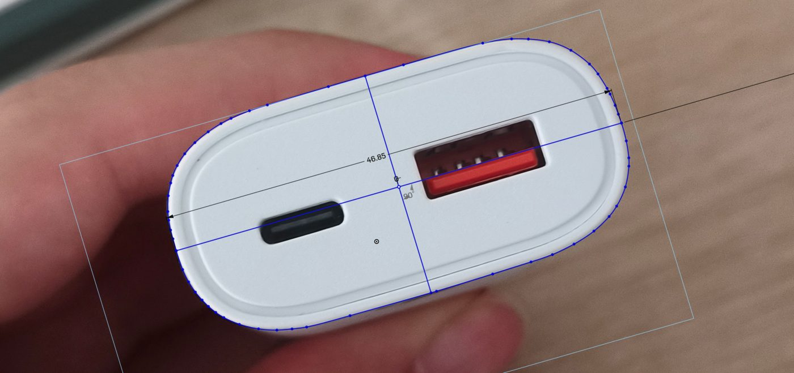
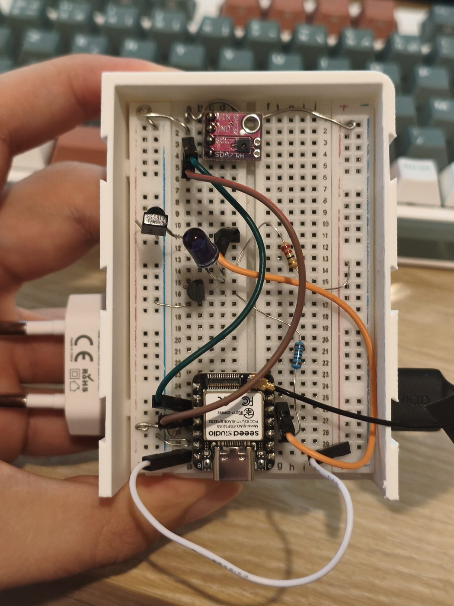
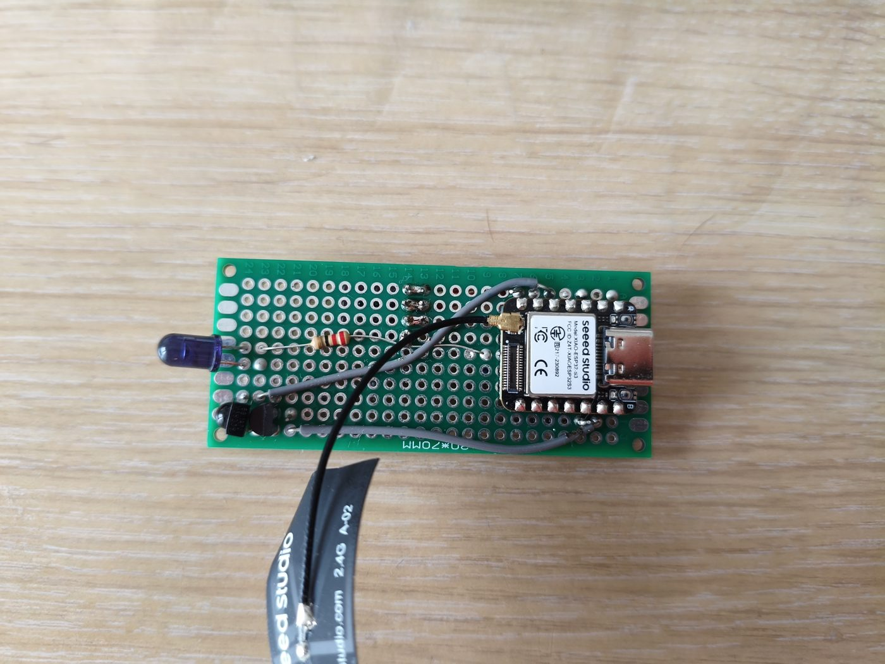
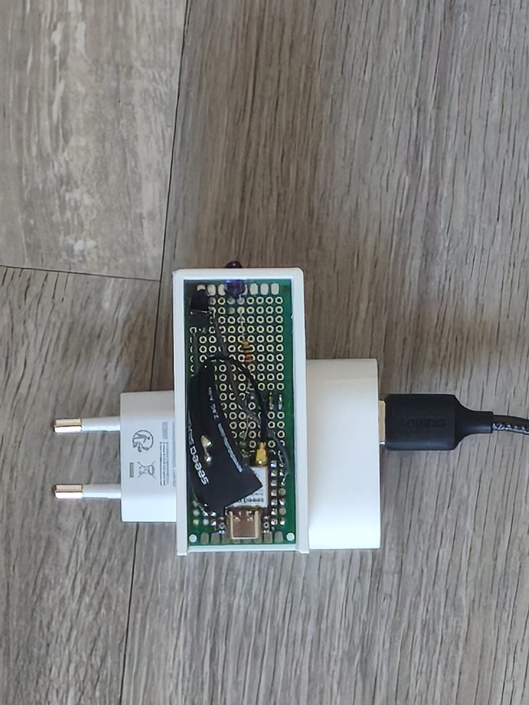
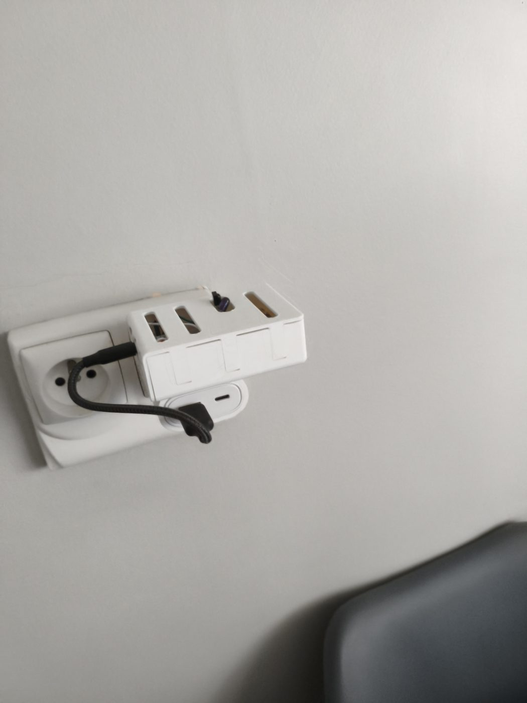

# Pilotage infrarouge de climatiseurs Toshiba par ESP32

Deux climatiseurs Toshiba, **aucune fonction connectée**, une seule télécommande. Ce projet leur en
donne une : deux boîtiers autonomes à base d'ESP32-S3 qui rejouent le protocole infrarouge de la
télécommande d'origine, servent leur propre interface Web et tiennent un planning horaire.

**Sans serveur domotique, sans cloud, sans machine allumée en permanence** — chaque boîtier fonctionne
seul, y compris si l'autre est débranché.

<p align="center">
  
</p>

## Ce que ça fait

- **Rétro-ingénierie du protocole** de la télécommande Toshiba WH-TG01NE, mesuré au récepteur IR
  plutôt que supposé.
- **Émission infrarouge** par un étage transistor + LED IR modulé à 38 kHz.
- **Interface Web servie par la carte elle-même**, en fichiers statiques : la modifier est un
  téléversement, pas une recompilation.
- **Planning horaire** en escalier, avec des points « maintenus » qui neutralisent un rallumage à la
  télécommande.
- **Boîtier conçu et imprimé en 3D**, qui se clipse sur un chargeur USB mural.

## Le résultat principal — le protocole est mesuré

C'est le verrou du projet, et il est levé. La télécommande émet un `TOSHIBA_AC` standard de **72 bits**
(modèle *Remote A*), répété deux fois par appui, porteuse 38 kHz.

```text
octet    0    1    2    3    4    5    6    7    8
        F2   0D   03   FC   01   4 0  00   00   41
                                 │              └── checksum = XOR des 8 premiers octets
                                 └── quartet haut = température − 17
```

Le checksum et l'encodage de la température sont **vérifiés sur tous les états capturés**. Les champs
mode, ventilation et swing restent à identifier : ils demandent la campagne de captures complète.

Preuve de bout en bout : la carte émet une trame que **son propre récepteur redécode octet pour
octet**, douze fois sur douze.

## Où ça en est

| | |
|---|---|
| Protocole de la télécommande | ✅ identifié et vérifié |
| Étage d'émission IR | ✅ monté et validé (boucle locale 12/12) |
| Interface Web | ✅ servie par la carte, testable sans matériel |
| Campagne de captures (mode / ventilation / swing) | 🟡 en cours |
| Preuve sur le climatiseur réel | 🟡 débloquée — exige d'être devant l'unité intérieure |
| Firmware définitif ESP-IDF | ⬜ volontairement pas écrit : le codec serait bâti sur des suppositions |

## Le matériel

| Élément | Choix |
|---|---|
| Carte | **Seeed XIAO ESP32-S3** (8 Mo flash, 8 Mo PSRAM, antenne IPEX) |
| Réception IR | TSOP38238, alimenté depuis un GPIO — 1,5 mA sur 40 mA admissibles |
| Émission IR | LED IR + transistor commuté à 38 kHz |
| Alimentation | chargeur USB mural, sur lequel le boîtier se clipse |

Le boîtier a été **relevé à la main sur une photo du chargeur**, puis dessiné par-dessus — il n'existait
pas de modèle de cette pièce.

| Relevé CAO sur photo | Prototype sur plaque d'essai | Carte perforée |
|---|---|---|
|  |  |  |

| Monté sur le chargeur | En place |
|---|---|
|  |  |

Le modèle du boîtier est fourni : [`cad/boitier-clim.step`](cad/boitier-clim.step).

## Contenu du dépôt

```text
ir-capture/                  firmwares de mise au point (PlatformIO) — capture, diagnostic, émission, interface
toshiba-climate-controller/  firmware définitif (à venir) et l'interface Web, en fichiers statiques
captures/                    relevés de la télécommande — des mesures physiques, le contenu le plus précieux
tools/                       export des captures en JSON, et une maquette d'API pour travailler sans matériel
cad/, images/                boîtier imprimé en 3D
docs/                        conception, journal de tests, carnet de mise au point
```

## Essayer sans matériel

L'interface ne dépend ni du codec, ni de la carte. Deux boîtiers simulés, un par terminal :

```bash
python tools/mock_api.py --port 8081 --name Salon --peer "Chambre=http://127.0.0.1:8082"
```

```bash
python tools/mock_api.py --port 8082 --name Chambre --peer "Salon=http://127.0.0.1:8081"
```

Puis ouvrir `http://127.0.0.1:8081/`. Les fichiers de `web/` sont servis tels quels : recharger la page
suffit après modification.

## Avec la carte

```bash
cp ir-capture/include/secrets.example.h ir-capture/include/secrets.h
```

Y mettre le SSID et le mot de passe — **le Wi-Fi doit être en 2,4 GHz**, l'ESP32-S3 ne voit pas le
5 GHz, et l'antenne IPEX doit être branchée avant la mise sous tension. Puis, depuis `ir-capture/` :

```bash
pio run -e webui --target uploadfs && pio run -e webui --target upload && pio device monitor
```

L'adresse IP s'affiche sur la console. Les autres environnements (`capture`, `scan`, `autodetect`,
`txtest`, `carrier`, `loopback`) sont décrits dans le carnet de mise au point.

## Documentation

| Document | Contenu |
|---|---|
| [docs/plan-projet-clim-toshiba-esp32.md](docs/plan-projet-clim-toshiba-esp32.md) | dossier de conception — la référence |
| [docs/cahier-des-charges-v2.md](docs/cahier-des-charges-v2.md) | périmètre étendu : planification et interface |
| [docs/api-v2.md](docs/api-v2.md) | contrat entre l'interface et le firmware |
| [docs/journal-de-tests.md](docs/journal-de-tests.md) | relevés datés, diagnostics, pannes et leur résolution |
| [docs/carnet-mise-au-point.md](docs/carnet-mise-au-point.md) | environnement, outils, câblage, commandes |
| [docs/migration-nouveau-pc.md](docs/migration-nouveau-pc.md) | reprendre le projet sur une autre machine |

## Limites assumées

- Le firmware `webui` n'est **pas** le firmware définitif : ni mot de passe, ni OTA, ni configuration
  persistante. Il ne s'utilise que sur le réseau domestique.
- L'étage d'émission est monté avec des valeurs de substitution : portée d'environ **1,5 m** au lieu
  de 1 à 5 m. Suffisant pour la preuve, pas pour l'installation définitive.
- L'infrarouge ne permet pas d'**empêcher** un démarrage : un point « maintenu » laisse la clim
  s'allumer, puis l'éteint. L'interface l'annonce plutôt que de le masquer.
- Aucune capacité n'est affichée comme acquise tant qu'elle n'est pas mesurée : les champs non
  vérifiés portent une pastille **non vérifié** dans l'interface.
