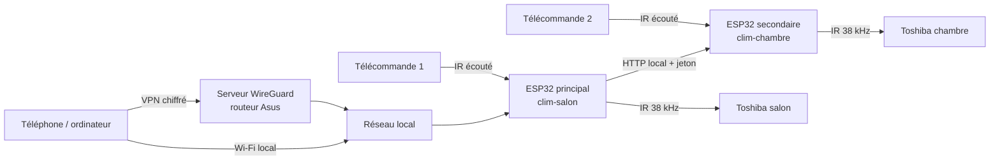

# Projet complet — Pilotage de deux climatiseurs Toshiba par ESP32 et infrarouge

> **Version 1.1 — 1er août 2026**  
> Cible initiale : climatiseur Toshiba `RAS-B18B2KVG-E`, télécommande `WH-TG01NE` portant aussi l'inscription `40525B`.  
> Carte retenue : **Seeed Studio XIAO ESP32-S3**.

### Changements de la version 1.1

La carte cible passe d'un ESP32 DevKit V1 à un **XIAO ESP32-S3** (ESP32-S3R8, 8 Mo de flash, 8 Mo de PSRAM). Ce n'est pas un simple changement de format : le SoC, le brochage disponible, la taille de flash, le périphérique RMT et la liaison série changent tous.

| Point corrigé | Version 1.0 | Version 1.1 |
|---|---|---|
| Brochage IR | GPIO26 / GPIO27 / GPIO25 | D1 (GPIO2) / D2 (GPIO3) / bouton BOOT (GPIO0) |
| Raison | — | Sur ESP32-S3, les GPIO26 à 37 sont réservés à la flash SPI et à la PSRAM octale |
| Flash | 4 Mo, binaire limité à 1,5 Mo | 8 Mo, partitions OTA de 3 Mo, contrainte levée |
| RMT | Blocs de 64 symboles | Blocs de **48** symboles, DMA disponible sur S3 |
| Filtre RX | « ignorer les impulsions < 100 µs » | Impossible au niveau matériel (plafond ~3 µs), filtrage logiciel |
| Console | UART 115200 bauds | USB-Serial-JTAG natif, débit sans objet |
| Étage LED IR | 39 Ω, ≈ 90 mA crête | 22 Ω, ≈ 155 mA crête, pour la portée visée |
| Base du transistor | 330 Ω | 1 kΩ (saturation moins violente) |
| Alternatives | 3 étudiées | Ajout de l'option ESPHome (§17.4) |
| Phase de capture | Firmware de diagnostic à écrire | Chemin rapide `IRremoteESP8266` d'abord (§8.0) |

## Sommaire

1. [Résumé exécutif](#1-résumé-exécutif)
2. [Ce qui est confirmé et ce qui reste à mesurer](#2-ce-qui-est-confirmé-et-ce-qui-reste-à-mesurer)
3. [Objectifs, périmètre et critères de réussite](#3-objectifs-périmètre-et-critères-de-réussite)
4. [Architecture générale](#4-architecture-générale)
5. [Matériel et nomenclature](#5-matériel-et-nomenclature)
6. [Schéma de câblage](#6-schéma-de-câblage)
7. [Architecture du firmware ESP-IDF](#7-architecture-du-firmware-esp-idf)
8. [Identification et validation du protocole IR](#8-identification-et-validation-du-protocole-ir)
9. [Modèle d'état et comportement](#9-modèle-détat-et-comportement)
10. [Interface Web et API](#10-interface-web-et-api)
11. [Réseau, accès WireGuard et sécurité](#11-réseau-accès-wireguard-et-sécurité)
12. [Mises à jour OTA et récupération](#12-mises-à-jour-ota-et-récupération)
13. [Déroulement du projet](#13-déroulement-du-projet)
14. [Plan de tests et recette](#14-plan-de-tests-et-recette)
15. [Risques et mesures de réduction](#15-risques-et-mesures-de-réduction)
16. [Installation, exploitation et maintenance](#16-installation-exploitation-et-maintenance)
17. [Alternatives étudiées](#17-alternatives-étudiées)
18. [Références](#18-références)

---

## 1. Résumé exécutif

Le projet consiste à construire **deux boîtiers autonomes**, un par climatiseur. Chaque boîtier comprend :

- une carte Seeed Studio XIAO ESP32-S3 ;
- un émetteur infrarouge suffisamment puissant pour commander la clim ;
- un récepteur infrarouge 38 kHz qui écoute aussi la télécommande d'origine ;
- une interface Web locale embarquée ;
- un firmware natif ESP-IDF, sans dépendance à un service cloud.

Le premier boîtier, `clim-salon`, servira de **tableau de bord principal**. Il affichera les deux climatiseurs et transmettra les commandes destinées au second boîtier, `clim-chambre`, sur le réseau local. Chaque boîtier restera néanmoins utilisable directement si l'autre est indisponible.

L'accès depuis l'extérieur de la maison passera exclusivement par le serveur **WireGuard déjà actif sur le routeur Asus**. Aucun ESP32 ne sera exposé directement sur Internet et aucune redirection de port ne devra être créée.

Le projet est techniquement faisable, mais il possède un jalon incontournable : **capturer les signaux de la télécommande WH-TG01NE**. Les bibliothèques communautaires savent gérer plusieurs protocoles de climatiseurs Toshiba, mais aucune source publique trouvée ne certifie la combinaison exacte `WH-TG01NE + RAS-B18B2KVG-E`. Le firmware sera donc conçu pour mesurer, décoder, tester puis seulement figer le protocole.

### Résultat attendu

Depuis un téléphone ou un ordinateur connecté au réseau domestique — directement ou par WireGuard — l'utilisateur pourra :

- allumer et éteindre chaque clim ;
- choisir le mode auto, froid, chauffage ou déshumidification ;
- régler la température ;
- choisir la ventilation parmi les valeurs réellement reconnues ;
- activer ou désactiver le swing ;
- voir la disponibilité de chaque boîtier ;
- voir la date et l'origine de la dernière commande connue.

L'interface affichera clairement **« état estimé »**. L'IR est unidirectionnel : même si le récepteur écoute la télécommande d'origine, le système ne peut pas prouver que la clim a reçu ou exécuté une commande.

---

## 2. Ce qui est confirmé et ce qui reste à mesurer

### 2.1 Éléments confirmés

| Élément | Statut | Justification |
|---|---:|---|
| Association `RAS-B18B2KVG-E` / `WH-TG01NE` | Confirmée | Le data book Toshiba de la gamme indique cette télécommande pour l'unité concernée. |
| Commande d'une clim Toshiba par ESP32 et IR | Faisable | Plusieurs implémentations communautaires existent pour des protocoles Toshiba proches. |
| Émission et réception IR natives sur ESP32-S3 | Confirmées | Le périphérique RMT d'Espressif est prévu pour les signaux de télécommande ; l'ESP32-S3 y ajoute la prise en charge du DMA. |
| Accès distant sans cloud | Confirmé | Le routeur Asus fournit déjà un serveur WireGuard actif. |
| Gestion de deux boîtiers sur le LAN | Faisable | Le boîtier principal agrégera l'état du second par API HTTP locale authentifiée. |

### 2.2 Éléments non confirmés avant essais physiques

| Point à vérifier | Pourquoi |
|---|---|
| Timings précis de la `WH-TG01NE` | Les valeurs communautaires servent d'hypothèse, pas de preuve pour cette télécommande. |
| Longueur exacte des trames | Les variantes Toshiba utilisent plusieurs longueurs et parfois plusieurs paquets. |
| Signification de `40525B` | Cette inscription ne doit pas être assimilée à « Remote B » sans capture. |
| Formule du checksum | Elle doit être validée par comparaison de plusieurs commandes. |
| Encodage du mode, du ventilateur et du swing | Les champs peuvent varier entre familles Toshiba. |
| Répétition des paquets | Certaines commandes peuvent comporter un paquet court ou un paquet de swing séparé. |
| Portée réelle de l'émetteur | Elle dépend de la LED, de son courant, de l'angle et de la position du boîtier. |

### 2.3 Décision de passage

Le développement complet de l'interface ne commencera qu'après obtention des trois preuves suivantes :

1. cinq captures cohérentes d'une même commande ;
2. retransmission brute capable de commander réellement la clim ;
3. identification reproductible du préambule, de la longueur et du checksum, ou d'un mécanisme équivalent de validation.

Si le protocole générique Toshiba n'est pas reconnu, le prototype de retransmission brute restera utilisable pour l'analyse, mais il ne sera pas considéré comme la solution finale.

---

## 3. Objectifs, périmètre et critères de réussite

### 3.1 Objectifs fonctionnels de la version 1

- Piloter deux climatiseurs, avec un boîtier par pièce.
- Prototyper et valider complètement le premier avant duplication.
- Disposer d'une page Web unique pour les deux appareils.
- Conserver une page locale de secours sur chaque boîtier.
- Écouter la télécommande d'origine pour maintenir un état estimé plus cohérent.
- Fonctionner sans cloud, abonnement ni compte externe.
- Permettre les mises à jour sans démonter le boîtier.
- Récupérer automatiquement après une coupure de courant ou une mise à jour ratée.

### 3.2 Fonctions incluses

- Marche et arrêt.
- Mode automatique.
- Mode froid.
- Mode chauffage.
- Mode déshumidification.
- Consigne de température, initialement prévue de 17 à 30 °C.
- Ventilation automatique et vitesses découvertes dans les captures.
- Swing activé ou désactivé.
- Diagnostic IR.
- État du réseau et version du firmware.
- Mise à jour OTA locale.

### 3.3 Hors périmètre de la version 1

- Connexion interne CN22/UART.
- Ouverture ou modification électrique de la clim.
- Remplacement de l'adaptateur Wi-Fi officiel Toshiba.
- Retour d'état garanti par la clim.
- Minuterie hebdomadaire.
- Modes silencieux, économie, puissance maximale ou « Hi Power ».
- Capteur de température ambiante indépendant.
- Application mobile native Android/iOS.
- Commande vocale.
- Exposition directe de l'ESP32 à Internet.

### 3.4 Critères de réussite

Le projet est accepté lorsque :

- les deux clims sont commandables depuis la même page ;
- chaque fonction exposée a été validée sur la clim réelle ;
- l'usage de la télécommande d'origine met à jour l'état estimé en moins d'une seconde ;
- les commandes fonctionnent depuis l'emplacement final du boîtier ;
- les deux appareils redémarrent seuls après coupure de courant ;
- l'accès extérieur fonctionne au travers de WireGuard ;
- aucun port des ESP32 n'est publié sur Internet ;
- une mise à jour défaillante provoque un retour automatique au firmware précédent.

---

## 4. Architecture générale



### 4.1 Rôle du boîtier principal

`clim-salon` :

- héberge la page générale ;
- expose l'état local ;
- interroge `clim-chambre` toutes les cinq secondes ;
- relaie les commandes destinées au second appareil ;
- signale le second boîtier hors ligne après trois échecs consécutifs ;
- ne bloque jamais sa propre commande IR si le second appareil est indisponible.

### 4.2 Rôle du boîtier secondaire

`clim-chambre` :

- pilote sa clim localement ;
- possède la même interface directe que le principal ;
- accepte les appels du principal avec un jeton d'appairage ;
- reste accessible par son adresse réservée en cas de panne du principal.

### 4.3 Synchronisation

Le principal récupère l'état du secondaire avec `GET /api/v1/status`. Une commande distante est envoyée avec un identifiant unique `command_id`. Le secondaire mémorise les 32 derniers identifiants pendant cinq minutes afin qu'une répétition réseau ne produise pas deux émissions IR.

### 4.4 Alternative : agrégation côté navigateur

Le relais principal/secondaire décrit ci-dessus coûte un composant `peer_client`, un jeton d'appairage, une interrogation périodique et un mode de panne supplémentaire.

Une variante consiste à déployer **deux boîtiers strictement identiques**, sans rôle, et à laisser la page servie par l'un interroger les deux adresses en JavaScript. Les sections `peer_task`, `peer_client` et `GET /api/v1/devices` disparaissent alors.

Contrainte à connaître avant de choisir : les deux boîtiers ayant des adresses IP distinctes, les appels sont considérés comme inter-sites par le navigateur. Un cookie `SameSite=Strict` tel que défini au §11.3 ne serait pas transmis. Cette variante impose donc un jeton porteur conservé côté navigateur et envoyé en en-tête `Authorization`, ainsi que des en-têtes CORS sur l'API.

Le choix entre les deux est à trancher au début de la phase 6, une fois le codec validé. La version 1 conserve par défaut l'architecture principal/secondaire du §4.1, qui n'impose aucune modification du modèle d'authentification.

---

## 5. Matériel et nomenclature

### 5.1 Nomenclature

| Composant | Prototype | Projet final | Spécification / rôle |
|---|---:|---:|---|
| Seeed XIAO ESP32-S3 | 1 | 2 | ESP32-S3R8, 8 Mo flash, 8 Mo PSRAM, USB-C |
| Antenne externe IPEX | 1 | 2 | Fournie avec la carte, **indispensable** ; connecteur fragile |
| Récepteur IR | 1 | 2 | `TSOP38438`, démodulé, 38 kHz, sortie à collecteur ouvert avec tirage interne |
| LED IR | 1 | 2 | `TSAL6400`, 940 nm, demi-angle ±25° |
| Transistor de commande | 1 | 2 | `PN2222A`, ou MOSFET logique `2N7002` / `AO3400` |
| Résistance de base | 1 | 2 | 1 kΩ, 1/4 W — inutile avec un MOSFET |
| Résistance de rappel | 1 | 2 | 10 kΩ, 1/4 W |
| Résistance LED IR | 1 | 2 | 22 Ω, 0,5 W — voir §5.2 |
| Résistance de découplage TSOP | 1 | 2 | 100 Ω, 1/4 W, en série avec l'alimentation du TSOP38438 |
| Condensateur céramique | 1 | 2 | 100 nF près du TSOP38438 |
| Condensateur électrolytique | 1 | 2 | 4,7 µF près du TSOP38438 |
| Condensateur réservoir | 1 | 2 | 100 µF sur le rail 5 V, près de l'étage d'émission |
| Bouton poussoir | 0 | 0 | Non requis : le bouton `BOOT` de la carte est réutilisé |
| Alimentation USB-C | 1 | 2 | 5 V, 1 A minimum, de qualité |
| Câble USB-C | 1 | 2 | Alimentation et maintenance |
| Plaque d'essai | 1 | — | Prototype uniquement |
| Plaque à souder ou PCB | — | 2 | Montage final |
| Boîtier | — | 2 | Ouverture pour LED IR, fenêtre pour le TSOP, accès USB-C, sortie d'antenne |

Prévoir quelques composants de rechange, en particulier deux LED IR, deux récepteurs, deux transistors et **une antenne IPEX supplémentaire** : le connecteur u.FL du XIAO supporte mal les branchements répétés.

Le XIAO ESP32-S3 ne dispose pas d'antenne céramique intégrée : l'antenne externe doit être branchée avant toute mise sous tension avec le Wi-Fi actif.

### 5.2 Justification de l'étage d'émission

Aucune broche du XIAO ne doit alimenter directement la LED IR : le maximum admissible par GPIO sur ESP32-S3 est très inférieur au courant utile. Le transistor fournit le courant d'impulsion, la broche ne fournit que le courant de base.

Avec une alimentation de 5 V, une chute d'environ 1,3 V dans la LED, environ 0,2 V dans le transistor saturé et une résistance de 22 Ω :

```text
Icrête ≈ (5,0 - 1,3 - 0,2) / 22 ≈ 155 mA
```

Ce courant n'est jamais continu. Il est haché par la porteuse à 38 kHz avec un rapport cyclique de 33 %, à l'intérieur de trames qui elles-mêmes ne durent que quelques dizaines de millisecondes et ne sont émises que sur action de l'utilisateur. Le courant moyen réel reste très faible.

La version 1.0 prévoyait 39 Ω, soit environ 90 mA crête : suffisant en visée directe à 2 ou 3 mètres, insuffisant pour la cible de 1 à 5 mètres avec un boîtier posé en biais. La valeur retenue est donc 22 Ω.

Contraintes à respecter :

- vérifier le courant d'impulsion maximal sur la fiche technique de la LED réellement achetée, ainsi que les conditions de durée et de rapport cyclique associées ;
- contrôler la valeur au multimètre, et à l'oscilloscope si disponible ;
- prévoir le condensateur réservoir de 100 µF sur le rail 5 V : les pistes du XIAO sont fines et les appels de courant à 155 mA feraient chuter la tension d'alimentation de la carte.

Le passage de 330 Ω à 1 kΩ pour la résistance de base réduit la sur-saturation du transistor. Avec 330 Ω, le courant de base atteignait environ 8 mA pour 155 mA de collecteur, soit un facteur de sur-commande inutile qui ralentit le blocage. Un MOSFET à seuil logique supprime complètement la question.

### 5.3 Placement

- Distance cible initiale : 1 à 5 mètres.
- La LED IR doit viser le récepteur de l'unité intérieure.
- Le TSOP38438 doit voir la télécommande depuis la zone d'usage normale.
- **Séparer physiquement la LED IR et le TSOP38438** : les orienter dos à dos et intercaler une cloison opaque. Sans cette précaution, le récepteur verra chaque émission du boîtier avec une amplitude énorme, y compris par réflexion sur les parois, et la relira comme une commande de télécommande. Le masquage logiciel de 150 ms du §9.2 est nécessaire mais ne suffit pas seul.
- Éviter le soleil direct, les lampes halogènes et les éclairages qui saturent le récepteur IR.
- Éloigner l'antenne Wi-Fi de toute masse métallique et ne pas la coincer contre le circuit imprimé.
- Installer le boîtier sans ouvrir la clim ni approcher ses conducteurs secteur.

---

## 6. Schéma de câblage

### 6.0 Brochage du XIAO ESP32-S3

La carte n'expose que onze entrées-sorties, nommées `D0` à `D10` sur la sérigraphie. Ces noms ne correspondent pas aux numéros de GPIO utilisés dans le code.

| Sérigraphie | GPIO | Autre fonction | Retenu pour |
|---|---:|---|---|
| `D0` | 1 | ADC1 | libre |
| `D1` | 2 | ADC1 | **émission IR** |
| `D2` | 3 | ADC1 | **réception IR** |
| `D3` | 4 | ADC1 | libre |
| `D4` | 5 | SDA | libre |
| `D5` | 6 | SCL | libre |
| `D6` | 43 | UART0 TX | réservé, à laisser libre |
| `D7` | 44 | UART0 RX | réservé, à laisser libre |
| `D8` | 7 | SCK | libre |
| `D9` | 8 | MISO | libre |
| `D10` | 9 | MOSI | libre |

Ressources internes utilisées sans câblage :

| Élément | GPIO | Remarque |
|---|---:|---|
| Bouton `BOOT` | 0 | Actif à l'état bas, lisible en fonctionnement, remplace le bouton du §6.3 |
| LED utilisateur | 21 | Allumée à l'état **bas**, sert d'indicateur d'état |
| USB natif | 19 / 20 | Console et téléversement, ne jamais réaffecter |

> **Broches interdites.** Sur ESP32-S3, les GPIO 26 à 37 sont câblés à la flash SPI et à la PSRAM octale du module. Le plan initial utilisait GPIO25, GPIO26 et GPIO27 : ces numéros ne sont pas seulement absents du connecteur du XIAO, leur usage ferait planter le module. Toute reprise de la version 1.0 doit être vérifiée sur ce point.

Les entrées-sorties fonctionnent en **3,3 V**. La broche `5V` de la carte est reliée au VBUS de l'USB-C et ne sert qu'à alimenter l'étage d'émission.

### 6.1 Émetteur IR

```text
                    +5 V
                      │
                [22 Ω / 0,5 W]
                      │
              anode  ─┤>|├─  cathode
                    TSAL6400
                      │
                      C
GPIO2 ───[1 kΩ]─── B  PN2222A
                   │  E
                 [10 kΩ]
                   │  │
GND ───────────────┴──┴────────────────
```

Connexions :

1. `D1` (GPIO2) vers la base du PN2222A au travers de 1 kΩ.
2. Résistance de 10 kΩ entre base et masse.
3. Émetteur du PN2222A à la masse.
4. Collecteur vers la cathode de la LED IR.
5. Anode de la LED vers la broche `5V` du XIAO au travers de 22 Ω / 0,5 W.
6. Condensateur de 100 µF entre `5V` et `GND`, au plus près de la résistance de 22 Ω.
7. Masse de l'alimentation et masse du XIAO communes.

La broche `5V` du XIAO est le VBUS de l'USB-C. L'étage d'émission ne passe donc pas par le régulateur 3,3 V de la carte.

### 6.2 Récepteur IR

```text
                        100 Ω
XIAO 3V3 ──────────────[100 Ω]──────────┬───────── VS   (broche 3)
                                        │
                                    ┌───┴───┐
                                 100 nF   4,7 µF
                                    └───┬───┘
XIAO GND ───────────────────────────────┴───────── GND  (broche 2)

XIAO D2 (GPIO3) ────────────────────────────────── OUT  (broche 1)
```

Le TSOP38438 accepte 2,5 à 5,5 V : l'alimenter en 3,3 V donne directement un niveau logique compatible avec l'ESP32-S3, sans adaptation.

La résistance de 100 Ω en série avec l'alimentation, associée au condensateur de 4,7 µF, forme le filtre recommandé par le fabricant. Elle isole le récepteur du bruit généré par l'étage d'émission et par le Wi-Fi.

La sortie du TSOP38438 possède un tirage interne : **aucune résistance de tirage externe n'est nécessaire** sur `D2`. La sortie est au niveau haut au repos et descend à l'état bas en présence d'une porteuse à 38 kHz.

Vérifier le brochage du composant livré : l'ordre des broches dépend de la référence et du boîtier. Sur un TSOP382xx/384xx Vishay vu de **face**, dôme vers soi et pattes vers le bas, l'ordre est `1 = OUT`, `2 = GND`, `3 = VS`. Ne pas se fier uniquement à la forme du boîtier.

### 6.3 Bouton

Le XIAO ESP32-S3 possède un bouton `BOOT` relié à GPIO0, lisible pendant le fonctionnement normal. Il remplace le bouton poussoir externe de la version 1.0 ; aucun câblage n'est requis.

```text
Bouton BOOT intégré ─── GPIO0 ─── actif à l'état bas
```

Le firmware active la résistance de tirage interne :

- appui de 3 secondes : démarrage du mode de configuration Wi-Fi ;
- appui de 8 secondes : effacement de la configuration réseau, de l'administrateur et de l'appairage, puis redémarrage ;
- aucun effacement du firmware ni des journaux de capture exportés.

> **Attention.** GPIO0 est une broche de démarrage. Maintenu enfoncé **au moment du reset ou de la mise sous tension**, le bouton `BOOT` fait entrer la carte en mode téléversement au lieu de lancer le firmware. Les appuis longs décrits ci-dessus ne doivent donc être effectués que carte déjà démarrée. Ce comportement est utile en secours : il garantit un accès au flashage même avec un firmware défaillant.

La LED utilisateur (GPIO21, allumée à l'état bas) indique l'état courant sans matériel supplémentaire : clignotement lent en mode configuration, allumage fixe une fois connecté, flash bref à chaque émission IR.

### 6.4 Contrôles avant alimentation

- Antenne IPEX branchée sur la carte.
- Absence de court-circuit entre `5V` et `GND`, et entre `3V3` et `GND`.
- Aucune tension supérieure à 3,3 V sur une broche `D0` à `D10`.
- Polarité de la LED IR confirmée.
- Brochage du PN2222A confirmé sur sa fiche technique.
- Brochage du TSOP38438 confirmé, dôme vers soi.
- Résistance de 22 Ω présente en série avec la LED.
- Résistance de 100 Ω présente en série avec l'alimentation du TSOP38438.
- Masse commune présente.
- Aucun fil relié à la clim elle-même.

---

## 7. Architecture du firmware ESP-IDF

### 7.1 Version et composants

- ESP-IDF `v5.5.3`, cible `esp32s3`.
- Langages C et C++.
- FreeRTOS pour les tâches concurrentes.
- Pilotes `driver/rmt_tx.h` et `driver/rmt_rx.h`.
- `esp_http_server` pour HTTP et WebSocket.
- `esp_wifi`, `esp_netif` et mDNS.
- NVS pour la configuration.
- `esp_ota_ops` pour les mises à jour et le rollback.
- `esp_timer` pour les délais fins.
- `esp_sntp` pour l'heure UTC.
- cJSON pour les charges utiles JSON.

La version `v5.5.3` est figée dans le projet. Un changement de branche ESP-IDF devra passer par une compilation complète et la recette de non-régression.

Options `sdkconfig.defaults` spécifiques à la carte :

| Option | Valeur | Raison |
|---|---|---|
| `CONFIG_IDF_TARGET` | `esp32s3` | Cible du XIAO |
| `CONFIG_ESPTOOLPY_FLASHSIZE_8MB` | activé | 8 Mo de flash |
| `CONFIG_ESP32S3_SPIRAM_SUPPORT` | activé | 8 Mo de PSRAM octale |
| `CONFIG_SPIRAM_MODE_OCT` | activé | Le module est un ESP32-S3**R8** |
| `CONFIG_ESP_CONSOLE_USB_SERIAL_JTAG` | activé | Console sur l'USB natif |
| `CONFIG_PARTITION_TABLE_CUSTOM` | activé | Table du §7.5 |

La PSRAM n'est pas nécessaire au produit fini, mais elle permet de conserver en mémoire un grand nombre de captures brutes pendant la phase 2.

### 7.1.1 Console série

Le XIAO ESP32-S3 ne comporte **aucune puce USB-UART**. Le connecteur USB-C attaque directement le périphérique USB-Serial-JTAG intégré au SoC. Conséquences :

- la notion de débit en bauds n'a plus d'objet ; la valeur `115200` mentionnée dans le plan initial est ignorée ;
- à chaque redémarrage, `panic` ou téléversement, le périphérique USB **disparaît et réapparaît sur l'hôte**. Le terminal se déconnecte et les messages émis pendant la réénumération sont perdus ;
- ce comportement se produit précisément au moment le plus gênant, c'est-à-dire lors d'un plantage pendant une capture.

Deux mesures compensent ce point :

1. L'export des captures par HTTP en JSON, déjà prévu au §8.1, devient le mécanisme principal et non un complément.
2. En cas de besoin d'une trace vraiment continue, un adaptateur USB-TTL peut être raccordé à `D6` / `D7` (UART0), qui sont laissés libres pour cette raison.

### 7.2 Organisation prévue

```text
toshiba-climate-controller/
├── CMakeLists.txt
├── sdkconfig.defaults
├── partitions.csv
├── main/
│   ├── app_main.c
│   └── CMakeLists.txt
├── components/
│   ├── climate_state/
│   ├── ir_transport/
│   ├── toshiba_codec/
│   ├── ir_diagnostics/
│   ├── settings/
│   ├── wifi_manager/
│   ├── auth/
│   ├── web_api/
│   ├── peer_client/
│   └── ota_manager/
├── web/
│   ├── index.html
│   ├── app.css
│   └── app.js
├── test/
│   ├── test_toshiba_codec/
│   ├── test_climate_state/
│   └── fixtures/
└── tools/
    ├── capture_export/
    └── sign_firmware/
```

### 7.3 Tâches FreeRTOS

| Tâche | Priorité relative | Responsabilité |
|---|---:|---|
| `ir_rx_task` | Haute | Réarmer le RMT RX, normaliser et transmettre les captures au décodeur |
| `ir_tx_task` | Haute | Sérialiser les émissions et gérer la période d'ignorance de l'écho |
| `climate_task` | Normale | Valider les changements et maintenir `ClimateState` |
| `web_task` | Normale | Servir l'interface et l'API |
| `peer_task` | Basse | Interroger le second boîtier toutes les cinq secondes |
| `maintenance_task` | Basse | NVS différée, SNTP, santé et journaux |

Les callbacks RMT exécutés en contexte d'interruption ne feront aucun traitement lourd. Ils déposeront uniquement un événement dans une file FreeRTOS avec les variantes `FromISR`.

### 7.4 RMT

L'API `driver/rmt_tx.h` et `driver/rmt_rx.h` d'ESP-IDF v5 est identique sur ESP32 et ESP32-S3, mais le périphérique sous-jacent diffère. L'ESP32-S3 dispose de **4 canaux d'émission et 4 canaux de réception séparés**, de blocs mémoire de **48 symboles** au lieu de 64, et — contrairement à l'ESP32 d'origine — d'un **accès DMA**.

Configuration initiale :

- résolution : 1 MHz, donc 1 tick = 1 µs ;
- porteuse TX : 38 kHz ;
- rapport cyclique : 33 % ;
- GPIO TX : **2** (`D1`) ;
- GPIO RX : **3** (`D2`) ;
- `mem_block_symbols` : multiple de 48 ;
- `flags.with_dma = true` sur le canal de réception ;
- fin de trame : `signal_range_max_ns` = 20 ms ;
- tampon utilisateur : au moins 512 symboles ;
- tolérance initiale de décodage : ±20 %, plafonnée à ±150 µs pour les impulsions courtes.

#### Correction : filtre de réception

Le plan initial demandait « ignorer les impulsions inférieures à 100 µs » au niveau du périphérique. **Ce réglage n'est pas réalisable en matériel.** Le registre de filtre anti-parasite du RMT est codé sur 8 bits dans le domaine d'horloge du groupe, ce qui plafonne `signal_range_min_ns` aux environs de **3 µs**. Une valeur de `100000` ns fait échouer `rmt_receive()` avec `ESP_ERR_INVALID_ARG`.

La configuration retenue est donc :

- `signal_range_min_ns` réglé à sa valeur utile réelle, de l'ordre de 1 à 2 µs, pour éliminer les parasites électriques ;
- le rejet des impulsions courtes mais non parasites, jusqu'à 100 µs, effectué **en logiciel** dans `ir_rx_task`, après copie des symboles.

Ce filtrage logiciel est de toute façon préférable : il est ajustable sans recompilation du pilote et les durées écartées restent visibles dans les diagnostics du §10.2.

#### Correction : taille des tampons

Avec des blocs de 48 symboles, un canal de réception peut au mieux emprunter la mémoire de ses voisins et atteindre 192 symboles, ce qui est inférieur aux 256 symboles annoncés en version 1.0. Une trame de climatiseur Toshiba, longue et souvent répétée, dépasse cette valeur.

Le pilote sait gérer ce cas par bascule automatique entre demi-blocs, en recopiant au fil de l'eau vers un tampon utilisateur plus grand. Les trames longues passent donc, à condition que le traitement d'interruption suive. L'activation du **DMA**, disponible sur ESP32-S3, supprime entièrement cette contrainte et écarte le risque de capture tronquée. C'est le réglage retenu, d'autant qu'une capture tronquée pendant la phase 2 serait interprétée à tort comme une variante de protocole.

Le seuil de fin de trame de 20 ms reste valide : à une résolution de 1 MHz, `signal_range_max_ns` peut exprimer jusqu'à environ 32,7 ms.

Les timings finaux seront remplacés par les médianes mesurées sur les captures valides.

### 7.5 Partition flash de référence

Le XIAO ESP32-S3 embarque **8 Mo de flash**, et non 4 Mo. La table est donc redimensionnée :

| Partition | Offset | Taille | Rôle |
|---|---:|---:|---|
| `nvs` | `0x9000` | `0x6000` | Configuration et état |
| `otadata` | `0xF000` | `0x2000` | Sélection OTA |
| `phy_init` | `0x11000` | `0x1000` | Initialisation radio |
| `ota_0` | `0x20000` | `0x300000` | Firmware A, 3 Mo |
| `ota_1` | `0x320000` | `0x300000` | Firmware B, 3 Mo |
| `storage` | `0x620000` | `0x1E0000` | Assets, captures et diagnostics, 1,875 Mo |

Fichier `partitions.csv` correspondant :

```text
# Name,   Type, SubType, Offset,   Size
nvs,      data, nvs,     0x9000,   0x6000
otadata,  data, ota,     0xF000,   0x2000
phy_init, data, phy,     0x11000,  0x1000
ota_0,    app,  ota_0,   0x20000,  0x300000
ota_1,    app,  ota_1,   0x320000, 0x300000
storage,  data, spiffs,  0x620000, 0x1E0000
```

La contrainte « binaire inférieur à 1,5 Mo » de la version 1.0 est **supprimée**. Elle était en réalité problématique : ESP-IDF avec Wi-Fi, serveur HTTP, WebSocket, OTA et interface embarquée atteint couramment 1,3 à 1,5 Mo, ce qui laissait une marge quasi nulle et aurait bloqué toute évolution, notamment l'ajout ultérieur du HTTPS local évoqué au §11.3.

Le contrôle de taille à la compilation est conservé, mais avec un seuil d'alerte à 2,5 Mo.

La partition `storage` de 1,875 Mo permet de conserver sur la carte l'intégralité des captures de la phase 2 plutôt qu'uniquement les dix dernières.

---

## 8. Identification et validation du protocole IR

### 8.0 Reconnaissance rapide avant tout développement

Le jalon de décision du §2.3 est le point le plus structurant du projet. Il ne justifie pas d'écrire d'abord un firmware de diagnostic complet.

La première action, une fois le montage de réception câblé, consiste à téléverser sur le XIAO l'exemple `IRrecvDumpV3` de la bibliothèque **IRremoteESP8266**, sous Arduino ou PlatformIO. Cette bibliothèque connaît déjà plusieurs variantes du protocole `TOSHIBA_AC`. En pointant la `WH-TG01NE` vers le TSOP38438, la sortie indique directement :

- si la trame est reconnue comme `TOSHIBA_AC`, et sous quelle longueur ;
- les octets d'état décodés ;
- la validité du checksum interne ;
- à défaut, le tableau brut des durées, directement exploitable pour la matrice du §8.2.

Cette étape demande une trentaine de minutes et tranche l'inconnue principale du projet avant tout investissement. Elle conditionne la suite :

| Résultat | Conséquence |
|---|---|
| Protocole reconnu et checksum valide | La phase 4 se réduit à transcrire un format connu ; l'option ESPHome du §17.4 devient réellement compétitive |
| Trame lue mais non reconnue | Le plan se déroule tel que prévu, avec des captures déjà exploitables |
| Rien n'est capté | Le problème est matériel et non protocolaire ; reprendre le §6.2 avant toute autre chose |

Vérifier que la version d'`IRremoteESP8266` utilisée prend en charge l'ESP32-S3 : ce support est arrivé tardivement dans la bibliothèque.

Le firmware de diagnostic du §8.1 reste nécessaire pour la campagne complète et pour l'export versionné, mais il est écrit **après** cette reconnaissance, avec la connaissance du format réel.

### 8.1 Firmware de diagnostic

Après l'étape §8.0, un firmware ESP-IDF spécialisé sera compilé avec :

- réception RMT continue sur GPIO3, DMA activé ;
- journalisation sur la console USB-Serial-JTAG, sans notion de débit ;
- export JSON des durées, mécanisme principal de récupération compte tenu des coupures USB décrites au §7.1.1 ;
- tentative de décodage Toshiba ;
- retransmission brute d'une capture sélectionnée ;
- page locale de diagnostic permettant de télécharger les dix dernières captures.

Format d'une capture :

```json
{
  "schema_version": 1,
  "device": "WH-TG01NE",
  "label": "cool_22_auto_swing_off",
  "sample": 1,
  "captured_at": "2026-07-25T12:00:00Z",
  "carrier_hz_assumed": 38000,
  "durations_us": [4380, 4370, 540, 1620, 540, 540],
  "decoded_bytes": [],
  "checksum_valid": false
}
```

Les exemples de durée ci-dessus sont seulement illustratifs. Les valeurs du produit seront celles réellement mesurées.

### 8.2 Matrice de capture

Pour chaque ligne, effectuer cinq pressions espacées d'au moins deux secondes :

| Identifiant | Commande |
|---|---|
| `off` | Arrêt |
| `cool_17_auto_off` | Froid, 17 °C, ventilation auto, swing arrêté |
| `cool_22_auto_off` | Froid, 22 °C, ventilation auto, swing arrêté |
| `cool_30_auto_off` | Froid, 30 °C, ventilation auto, swing arrêté |
| `heat_17_auto_off` | Chauffage, 17 °C |
| `heat_22_auto_off` | Chauffage, 22 °C |
| `heat_30_auto_off` | Chauffage, 30 °C |
| `auto_22_auto_off` | Auto, 22 °C |
| `dry_22_auto_off` | Déshumidification, 22 °C |
| `cool_22_fan_N_off` | Une capture par vitesse de ventilation |
| `cool_22_auto_on` | Swing activé |
| `cool_22_auto_off_2` | Swing désactivé après activation |

Les piles de la télécommande doivent être neuves ou vérifiées. La télécommande sera placée à 20–50 cm du récepteur pendant l'analyse.

### 8.3 Méthode d'analyse

1. Supprimer les captures tronquées ou saturées.
2. Aligner les cinq captures d'une même commande.
3. Regrouper les durées en marques, espaces courts, espaces longs et séparateurs.
4. Calculer la médiane et l'écart maximal par groupe.
5. Déterminer l'ordre des bits, la longueur et les éventuels paquets multiples.
6. Rechercher le préambule Toshiba communautaire, notamment `F2 0D`, sans le considérer comme obligatoire.
7. Comparer deux commandes ne différant que par un paramètre.
8. Identifier les octets de température, mode, ventilateur et swing.
9. Dériver puis vérifier le checksum sur toutes les captures.
10. Créer un vecteur de test « trame brute ↔ état » pour chaque commande.

Une trame n'est acceptée que si la longueur, le préambule ou marqueur équivalent, les champs de cohérence et le checksum sont valides.

### 8.4 Stratégie de repli

Si le format n'est pas reconnu :

- conserver les captures brutes ;
- prouver la portée par retransmission brute de `off` et `cool_22_auto_off` ;
- capturer des paires qui ne diffèrent que d'un seul paramètre ;
- documenter les bits variables ;
- implémenter le codec seulement lorsque le checksum est compris.

La retransmission brute ne sera pas étendue à toutes les combinaisons. Une matrice brute complète serait difficile à maintenir et risquerait de masquer une erreur de protocole.

### 8.5 Encodeur et décodeur

Le composant `toshiba_codec` fournira :

```c
esp_err_t toshiba_encode(
    const climate_state_t *state,
    toshiba_frame_t *frame);

esp_err_t toshiba_decode(
    const rmt_symbol_word_t *symbols,
    size_t symbol_count,
    climate_state_t *state,
    toshiba_decode_info_t *info);
```

`toshiba_decode_info_t` contiendra au minimum :

- longueur détectée ;
- timings moyens ;
- octets bruts ;
- validité du checksum ;
- variante de protocole ;
- motif du rejet.

---

## 9. Modèle d'état et comportement

### 9.1 Type principal

```c
typedef enum {
    CLIMATE_MODE_AUTO,
    CLIMATE_MODE_COOL,
    CLIMATE_MODE_HEAT,
    CLIMATE_MODE_DRY
} climate_mode_t;

typedef enum {
    CLIMATE_SOURCE_WEB,
    CLIMATE_SOURCE_REMOTE,
    CLIMATE_SOURCE_RESTORED
} climate_source_t;

typedef enum {
    CLIMATE_CONFIDENCE_FRESH,
    CLIMATE_CONFIDENCE_STALE,
    CLIMATE_CONFIDENCE_UNKNOWN
} climate_confidence_t;

typedef struct {
    bool power;
    climate_mode_t mode;
    uint8_t target_temperature_c;
    uint8_t fan;
    bool swing;
    climate_source_t source;
    climate_confidence_t confidence;
    int64_t updated_at_unix;
    uint32_t revision;
} climate_state_t;
```

### 9.2 Règles

- Température acceptée : 17 à 30 °C, sauf si les captures prouvent une plage différente.
- Les valeurs de ventilation sont découvertes puis inscrites dans la configuration de capacité.
- Un changement Web valide produit une trame complète et incrémente `revision`.
- Une trame reçue de la télécommande met à jour l'état uniquement après validation complète.
- Pendant une émission, le RX est masqué ; il reste ignoré 150 ms après la fin.
- L'état est `fresh` pendant quinze minutes après une commande ou une capture valide.
- Après quinze minutes, il devient `stale`.
- Après le premier démarrage sans état restauré, il est `unknown`.
- Un état restauré depuis NVS est immédiatement `stale`.
- L'état n'est écrit en NVS qu'après deux secondes sans modification afin de limiter l'usure de la flash.

### 9.3 Échec d'émission

Le succès RMT signifie seulement que le signal a été émis. L'API répond :

- `transmitted: true` si la transaction RMT s'est terminée ;
- `confirmed_by_ac: false` dans tous les cas de la version IR ;
- `state.confidence: fresh` pour signaler une estimation récente, pas une confirmation.

---

## 10. Interface Web et API

### 10.1 Interface utilisateur

La page sera embarquée dans le firmware et ne chargera aucune ressource externe.

Elle comportera :

- une barre d'état avec connexion, heure et version ;
- deux cartes, `Salon` et `Chambre` ;
- un bouton marche/arrêt ;
- un sélecteur de mode ;
- des boutons `–` et `+` pour la température ;
- un sélecteur de ventilation ;
- un interrupteur de swing ;
- la mention visible `État estimé` ;
- l'heure et la source de la dernière modification ;
- un indicateur `En ligne`, `Hors ligne` ou `État inconnu` ;
- une zone d'administration séparée pour Wi-Fi, pairage, diagnostic et OTA.

Les contrôles du second appareil sont désactivés s'il est hors ligne. L'appareil local reste commandable.

### 10.2 API

Toutes les réponses utilisent UTF-8 et `application/json`.

#### `GET /api/v1/status`

Réponse :

```json
{
  "schema_version": 1,
  "device_id": "clim-salon",
  "display_name": "Salon",
  "role": "primary",
  "online": true,
  "state": {
    "power": true,
    "mode": "cool",
    "target_temperature_c": 22,
    "fan": "auto",
    "swing": false,
    "source": "web",
    "confidence": "fresh",
    "updated_at": "2026-07-25T12:00:00Z",
    "revision": 42
  },
  "capabilities": {
    "temperature_min_c": 17,
    "temperature_max_c": 30,
    "modes": ["auto", "cool", "heat", "dry"],
    "fans": ["auto", "low", "medium", "high"],
    "swing": true
  },
  "wifi": {
    "rssi_dbm": -54,
    "ip": "192.168.1.40"
  },
  "firmware": "1.0.0"
}
```

#### `PUT /api/v1/climate`

Requête :

```json
{
  "command_id": "01J3R5H9V8K3W6Y2P0B4M7Q9X1",
  "power": true,
  "mode": "cool",
  "target_temperature_c": 22,
  "fan": "auto",
  "swing": false,
  "expected_revision": 41
}
```

Réponse :

```json
{
  "accepted": true,
  "transmitted": true,
  "confirmed_by_ac": false,
  "state": {
    "power": true,
    "mode": "cool",
    "target_temperature_c": 22,
    "fan": "auto",
    "swing": false,
    "source": "web",
    "confidence": "fresh",
    "revision": 42
  }
}
```

`expected_revision` évite d'écraser silencieusement une modification plus récente. Une révision différente produit `409 Conflict` avec l'état courant.

#### `GET /api/v1/devices`

Disponible sur le principal. Retourne les deux objets de statut et l'heure du dernier contact avec le secondaire.

#### `GET /api/v1/diagnostics/ir`

Réservé à l'administrateur. Retourne :

- les dix dernières captures ;
- la dernière trame décodée ;
- les timings mesurés ;
- le checksum ;
- les compteurs de trames valides et rejetées.

#### `POST /api/v1/system/ota`

Accepte une image `.bin` et sa signature. La taille maximale est vérifiée avant écriture.

#### `GET /healthz`

Réponse minimale :

```json
{
  "status": "ok",
  "uptime_s": 86400,
  "ir_rx": true,
  "ir_tx": true,
  "nvs": true
}
```

#### `/ws`

WebSocket authentifié. Événements :

- `state.changed` ;
- `device.online` ;
- `device.offline` ;
- `ir.received` ;
- `ota.progress` ;
- `error`.

### 10.3 Codes d'erreur

| Code | Usage |
|---:|---|
| 400 | JSON ou valeur invalide |
| 401 | Session ou jeton absent/invalide |
| 403 | Action interdite ou CSRF invalide |
| 404 | Ressource inconnue |
| 409 | Révision d'état obsolète ou OTA déjà active |
| 413 | Firmware ou charge utile trop grande |
| 429 | Trop de tentatives de connexion |
| 503 | File IR pleine ou second appareil inaccessible |

---

## 11. Réseau, accès WireGuard et sécurité

### 11.1 Mise en service Wi-Fi

Au premier démarrage :

1. L'ESP32 génère un mot de passe d'installation aléatoire de douze caractères.
2. Il l'affiche sur le port série.
3. Il crée `Clim-Toshiba-Setup-XXXX`.
4. L'utilisateur se connecte à ce point d'accès.
5. Une page locale demande le SSID, le mot de passe Wi-Fi, le nom du boîtier, son rôle et le mot de passe administrateur.
6. Les données sont enregistrées dans NVS.
7. Le point d'accès disparaît après connexion réussie.

La configuration ne réapparaît qu'après un appui de trois secondes sur le bouton `BOOT` (GPIO0), carte déjà démarrée, ou si la connexion échoue pendant cinq minutes consécutives.

Le mot de passe d'installation étant affiché sur la console USB, tenir compte du §7.1.1 : ouvrir le terminal **avant** la mise sous tension, sinon le message est manqué. Le mot de passe est réaffiché toutes les dix secondes tant que le point d'accès est actif.

### 11.2 Paramétrage du routeur Asus

- Créer une réservation DHCP pour chaque adresse MAC.
- Nommer les réservations `clim-salon` et `clim-chambre`.
- Autoriser les clients WireGuard à joindre le sous-réseau domestique.
- Vérifier que le profil téléphone inclut la route du LAN.
- Ne créer aucune règle NAT ou redirection TCP vers les ESP32.
- Si l'isolation des clients Wi-Fi est active, autoriser explicitement les communications entre les deux ESP32.

Les adresses IP réservées seront saisies dans la configuration du principal. mDNS pourra être activé pour le confort local, mais le fonctionnement ne dépendra pas de sa traversée dans WireGuard.

### 11.3 Authentification

- Mot de passe administrateur : minimum douze caractères.
- Stockage : PBKDF2-HMAC-SHA-256, sel aléatoire de 128 bits, 100 000 itérations.
- Session : jeton aléatoire de 256 bits.
- Cookie : `HttpOnly`, `SameSite=Strict`.
- Durée : trente minutes d'inactivité, douze heures maximum.
- Protection CSRF sur toutes les modifications.
- Limitation : cinq échecs de connexion par minute, puis attente progressive.
- Appairage entre boîtiers : jeton aléatoire de 256 bits distinct du compte administrateur.

Le trafic HTTP local n'est pas exposé sur Internet. WireGuard chiffre le trajet extérieur ; le Wi-Fi domestique doit rester protégé par WPA2 ou WPA3. L'activation d'un serveur HTTPS local avec autorité privée pourra être ajoutée plus tard si le réseau local n'est pas considéré comme fiable.

### 11.4 Journalisation

Les journaux ne contiennent jamais :

- mot de passe Wi-Fi ;
- mot de passe administrateur ;
- jeton de session ;
- jeton d'appairage ;
- clé WireGuard.

Ils peuvent contenir :

- identifiant de commande tronqué ;
- résultat d'émission ;
- code d'erreur ;
- timings IR ;
- version du firmware ;
- RSSI et adresse IP locale.

---

## 12. Mises à jour OTA et récupération

### 12.1 Format

Chaque version produit :

- `toshiba-climate-controller.bin` ;
- `toshiba-climate-controller.bin.sig` ;
- un manifeste JSON avec version, taille et SHA-256.

La signature ECDSA P-256 est créée hors de l'ESP32. Seule la clé publique est intégrée au firmware.

### 12.2 Déroulement

1. L'administrateur sélectionne le binaire et sa signature.
2. Le firmware vérifie la taille et la signature.
3. Il écrit dans la partition OTA inactive.
4. Il redémarre sur cette partition.
5. Le nouveau firmware initialise NVS, RMT, Wi-Fi et serveur Web.
6. Il se déclare valide seulement après réussite de ces contrôles, dans les trente secondes.
7. En cas de crash ou d'échec, le bootloader revient à la version précédente.

### 12.3 Récupération

- L'USB reste accessible sans démonter entièrement le boîtier.
- Le bouton de maintenance ne détruit jamais les deux partitions OTA.
- Une image de secours et les commandes de flashage sont conservées avec la documentation.
- La configuration NVS possède un numéro de schéma et des migrations explicites.

---

## 13. Déroulement du projet

### Phase 0 — Documentation et préparation

Livrables :

- dossier de conception ;
- nomenclature ;
- câblage ;
- liste des captures ;
- critères de recette ;
- répertoire de sauvegarde des captures.

Sortie de phase : composants disponibles et montage revu.

### Phase 1 — Prototype électrique

L'ordre est important : le **récepteur seul d'abord**, sans l'étage d'émission. Il n'y a rien à valider côté émission tant qu'on ne sait pas ce qu'il faut émettre, et un émetteur monté trop tôt pollue les captures.

Actions, étape 1a — réception seule :

- brancher l'antenne IPEX ;
- monter le TSOP38438 selon le §6.2 sur une plaque d'essai ;
- vérifier la présence du 3,3 V et le brochage avant mise sous tension ;
- confirmer que la sortie `OUT` est au niveau haut au repos et bascule à l'appui d'une touche de la télécommande ;
- exécuter la reconnaissance rapide du §8.0.

Actions, étape 1b — émission, seulement après captures exploitables :

- monter l'étage transistorisé du §6.1 ;
- contrôler le courant impulsionnel de la LED ;
- tester le bouton `BOOT` ;
- vérifier que le TSOP38438 ne relit pas les émissions du boîtier, cloison en place.

Sortie de phase : aucune surchauffe et captures RMT stables.

### Phase 2 — Capture de la WH-TG01NE

Actions :

- exécuter la reconnaissance `IRremoteESP8266` du §8.0 et décider de la suite ;
- exécuter la matrice complète ;
- sauvegarder cinq échantillons par commande ;
- documenter l'état visible sur l'écran de la télécommande ;
- éliminer les captures incohérentes.

Sortie de phase : jeu de captures versionné et reproductible.

### Phase 3 — Preuve sur la clim

Actions :

- retransmettre `off` ;
- retransmettre `cool_22_auto_off` ;
- tester à 1 m, 3 m puis à l'emplacement final ;
- ajuster l'orientation, pas le courant au-delà des limites du composant.

Sortie de phase : la clim réagit aux deux commandes.

### Phase 4 — Codec Toshiba

Actions :

- dériver le format ;
- implémenter encodeur et décodeur ;
- intégrer le checksum ;
- créer les tests unitaires à partir des captures ;
- valider tous les états exposés.

Sortie de phase : toutes les captures de référence passent les tests.

### Phase 5 — Produit local

Actions :

- ajouter NVS, Wi-Fi, authentification et interface Web ;
- ajouter l'écoute permanente de la télécommande ;
- gérer redémarrage et état obsolète ;
- ajouter diagnostics.

Sortie de phase : une clim est pilotable de façon autonome.

### Phase 6 — Multi-appareils et WireGuard

Actions :

- installer le second firmware ;
- réserver les adresses DHCP ;
- créer le jeton d'appairage ;
- activer l'agrégation ;
- tester depuis le réseau mobile au travers de WireGuard.

Sortie de phase : les deux clims sont utilisables depuis la même page.

### Phase 7 — OTA, boîtiers et recette

Actions :

- activer signature et rollback ;
- souder les montages ;
- installer les boîtiers ;
- exécuter la recette ;
- sauvegarder binaires, signatures, configuration non secrète et captures.

Sortie de phase : projet version 1 accepté.

### Charge indicative

| Phase | Charge indicative hors attente de matériel |
|---|---:|
| Prototype et mesure | 0,5 à 1 jour |
| Capture et analyse | 1 à 2 jours |
| Codec et tests | 1 à 4 jours selon variante |
| Web, état et sécurité | 2 à 4 jours |
| Multi-appareils et WireGuard | 0,5 à 1 jour |
| OTA, boîtiers et recette | 1 à 2 jours |

Le principal facteur d'incertitude est le protocole exact de la WH-TG01NE.

---

## 14. Plan de tests et recette

### 14.1 Tests unitaires

- Encodage de chaque fixture vers les octets attendus.
- Décodage de chaque capture vers l'état attendu.
- Rejet d'un checksum modifié.
- Rejet d'une trame tronquée.
- Tolérance aux variations de timing admises.
- Rejet des durées hors tolérance.
- Validation des températures 17 et 30 °C.
- Rejet de 16 et 31 °C.
- Sérialisation et migration du modèle NVS.
- Détection de conflit par `revision`.
- Détection d'un `command_id` déjà traité.

### 14.2 Tests matériels

- Vérifier la porteuse à 38 kHz.
- Mesurer le courant d'impulsion de la LED IR et le comparer à la valeur calculée d'environ 155 mA.
- Vérifier que la tension sur la broche `5V` ne s'effondre pas pendant une trame, condensateur de 100 µF en place.
- Vérifier l'absence d'échauffement anormal pendant une heure.
- Mesurer le RSSI antenne branchée puis débranchée, pour confirmer que l'antenne est bien connectée.
- Capturer cinq fois la même commande sans erreur.
- Émettre vingt commandes depuis l'emplacement final.
- Tester avec éclairage normal, pièce sombre et lumière du jour.
- Vérifier que l'émetteur ne crée pas une fausse mise à jour RX.

### 14.3 Tests fonctionnels

Pour chaque clim :

- marche puis arrêt ;
- auto ;
- froid à 17, 22 et 30 °C ;
- chauffage à 17, 22 et 30 °C ;
- déshumidification ;
- chaque ventilation exposée ;
- swing activé et désactivé ;
- commande par télécommande d'origine ;
- redémarrage après commande ;
- restauration de l'état en `stale`.

### 14.4 Tests réseau

- Perte et retour du Wi-Fi.
- Changement d'adresse empêché par la réservation DHCP.
- Second boîtier hors tension.
- Principal hors tension avec accès direct au secondaire.
- Latence et répétition réseau sans double émission.
- Accès par WireGuard depuis un téléphone en 4G/5G.
- Vérification externe de l'absence de redirection de port.
- Rejet d'un jeton pair invalide.
- Expiration de session.
- Protection CSRF.

### 14.5 Tests OTA

- Installation d'une version valide.
- Rejet d'une signature incorrecte.
- Rejet d'un fichier trop grand.
- Coupure simulée pendant le transfert.
- Firmware de test ne validant pas son démarrage.
- Retour automatique à la version précédente.
- Conservation de la configuration après mise à jour.

### 14.6 Fiche de recette finale

| Critère | Seuil | Résultat |
|---|---:|---|
| Captures identiques | 5/5 par commande | À compléter |
| Commandes réussies au point d'installation | 20/20 | À compléter |
| Mise à jour depuis télécommande | < 1 s | À compléter |
| Reconnexion Wi-Fi | < 60 s | À compléter |
| Détection du secondaire hors ligne | < 20 s | À compléter |
| Accès par WireGuard | Fonctionnel | À compléter |
| OTA valide | Réussie | À compléter |
| Rollback | Réussi | À compléter |
| Température des composants | Sans échauffement anormal | À compléter |

---

## 15. Risques et mesures de réduction

| Risque | Probabilité | Impact | Réduction |
|---|---:|---:|---|
| Protocole différent du Toshiba générique | Moyenne | Élevé | Jalon de capture, retransmission brute, analyse différentielle |
| Checksum non compris | Moyenne | Élevé | Captures par paires, nombreux états, comparaison communautaire |
| Portée IR insuffisante | Moyenne | Moyen | Étage transistorisé, LED adaptée, essais à la position finale |
| Récepteur saturé par la lumière | Moyenne | Moyen | Positionnement, découplage, protection mécanique |
| État Web différent de la clim | Élevée | Moyen | Mention « estimé », écoute de la télécommande, date et confiance |
| Double commande réseau | Faible | Moyen | `command_id` idempotent et file d'émission unique |
| Second boîtier indisponible | Moyenne | Faible | Interface locale de secours et dégradation indépendante |
| Perte de configuration | Faible | Moyen | NVS versionnée, écriture différée, sauvegarde |
| Mise à jour défaillante | Faible | Élevé | Deux partitions OTA, signature et rollback |
| Exposition Internet accidentelle | Faible | Élevé | WireGuard uniquement, aucune redirection, vérification de recette |
| Surchauffe de la LED ou du transistor | Faible | Élevé | Résistance dimensionnée, mesure du courant, test d'une heure |
| Brochage erroné d'un composant | Moyenne | Moyen | Vérification systématique des fiches techniques avant alimentation |
| Reprise d'un GPIO de la version 1.0 sur ESP32-S3 | Moyenne | Élevé | Tableau de brochage §6.0, GPIO 26 à 37 interdits, relecture avant chaque câblage |
| Capture RMT tronquée prise pour une variante de protocole | Moyenne | Élevé | DMA activé, contrôle de la longueur, rejet des captures incohérentes |
| Journaux perdus lors d'une coupure USB | Élevée | Faible | Export HTTP prioritaire, UART0 de secours sur `D6`/`D7` |
| Antenne IPEX débranchée ou connecteur cassé | Moyenne | Moyen | Contrôle du RSSI en recette, antenne de rechange en stock |
| Émission relue par le récepteur du même boîtier | Élevée | Moyen | Séparation physique, cloison opaque, masquage RX de 150 ms |

---

## 16. Installation, exploitation et maintenance

### 16.1 Installation

1. Fixer le boîtier sans percer ni ouvrir la clim.
2. Orienter la LED IR vers la fenêtre réceptrice de l'unité.
3. Orienter le récepteur vers la zone d'utilisation de la télécommande.
4. Brancher l'alimentation 5 V.
5. Vérifier l'adresse attribuée par le routeur.
6. Effectuer une commande d'arrêt puis une commande de froid.
7. Marquer physiquement le nom et l'adresse du boîtier.

### 16.2 Utilisation quotidienne

- Vérifier la mention `En ligne`.
- Considérer l'état comme une estimation.
- En cas de doute, envoyer un état complet plutôt qu'une variation relative.
- Utiliser la télécommande normalement dans le champ du récepteur.
- Se connecter d'abord à WireGuard depuis l'extérieur.

### 16.3 Sauvegardes

Conserver hors de l'ESP32 :

- code source et version ESP-IDF ;
- captures IR JSON ;
- fixtures de tests ;
- binaires et signatures des deux dernières versions ;
- schéma de câblage ;
- paramètres non secrets ;
- procédure de récupération USB.

Ne jamais placer les mots de passe ou clés WireGuard dans le dépôt du projet.

### 16.4 Maintenance

- Contrôle trimestriel de l'alimentation et du boîtier.
- Test d'une commande locale et d'une commande WireGuard.
- Mise à jour corrective seulement après recette sur le prototype.
- Conservation d'une version stable connue dans la partition de secours.
- Nouvelle campagne de captures si une télécommande ou une clim différente est ajoutée.

---

## 17. Alternatives étudiées

### 17.1 Adaptateur Wi-Fi Toshiba

La documentation Toshiba mentionne des adaptateurs Wi-Fi officiels pour cette génération. Cette voie est simple matériellement, mais repose sur l'application et l'infrastructure cloud du fabricant. Aucune API locale publique et stable n'a été trouvée pour ce modèle.

### 17.2 Connexion interne UART/CN22

Des projets communautaires comme `esphome_toshiba_suzumi`, `shorai-esp32` et `TConnect` se connectent au bus interne de certaines unités Toshiba. Ils peuvent fournir un retour d'état réel, ce que l'IR ne permet pas.

Cette solution n'est pas retenue pour la version 1 parce que :

- la compatibilité du `RAS-B18B2KVG-E` n'est pas confirmée ;
- elle nécessite l'ouverture de l'unité intérieure ;
- elle expose à des erreurs de niveau logique et à la proximité du secteur ;
- le besoin initial peut être satisfait sans modification de la clim.

### 17.3 ESPHome et Home Assistant

ESPHome propose une plateforme `climate_ir` avec un composant Toshiba, et s'exécute sans difficulté sur un XIAO ESP32-S3. Associé à Home Assistant, il fournit sans développement l'essentiel de ce que décrivent les sections 7, 10, 11 et 12 de ce document : interface utilisateur, agrégation des deux appareils, authentification, mises à jour à distance avec retour arrière, et accès extérieur.

Cette alternative aurait dû figurer dans la version 1.0 : c'est celle qui concurrence le plus directement l'approche retenue.

| Critère | Firmware ESP-IDF dédié | ESPHome + Home Assistant |
|---|---|---|
| Charge de travail | 5 à 14 jours | Un après-midi si le protocole est reconnu |
| Dépendance | Aucune | Une instance Home Assistant à héberger et maintenir |
| Protocole atypique | Contrôle total sur le décodage | Nécessite d'écrire un composant externe |
| Accès distant | WireGuard, déjà prévu | WireGuard également |
| Interface | À écrire entièrement | Fournie |
| Valeur d'apprentissage | Élevée | Faible |

Le choix dépend du résultat du §8.0 et de l'objectif réel :

- si la `WH-TG01NE` est reconnue directement et que le besoin est de piloter les clims rapidement, ESPHome est le choix rationnel ;
- si le protocole s'avère atypique, l'avantage d'ESPHome s'effondre : il faudrait de toute façon écrire le décodage, sans le contrôle qu'offre ESP-IDF ;
- si l'objectif inclut la maîtrise d'ESP-IDF et l'absence de toute infrastructure tierce, le plan principal reste pertinent quel que soit le résultat de la capture.

Cette décision est à prendre à la fin de la phase 2, pas avant.

### 17.4 Cloud tiers

Une passerelle cloud simplifierait parfois l'accès à distance, mais introduirait une dépendance externe, des comptes et une surface de sécurité supplémentaire. WireGuard fournit déjà l'accès nécessaire.

---

## 18. Références

### Documentation officielle

- [Toshiba — Data book Seiya Classic, incluant RAS-B18B2KVG-E et WH-TG01NE](https://www.toshibapro.fi/en/tuotteet/kotitaloudet/split-system/seiya-classic/databook-seiya-classic-e/at_download/file)
- [Espressif — Remote Control Transceiver (RMT)](https://docs.espressif.com/projects/esp-idf/en/latest/esp32/api-reference/peripherals/rmt.html)
- [Espressif — versions publiées d'ESP-IDF](https://github.com/espressif/esp-idf/releases)
- [Toshiba — Home AC Control](https://www.toshiba-aircon.co.uk/wp-content/uploads/2021/09/20210901_OM_1120490404_Toshiba_Home_AC_Control_EN.pdf)

### Références communautaires IR

- [IRremoteESP8266](https://github.com/crankyoldgit/IRremoteESP8266)
- [Protocoles supportés par IRremoteESP8266](https://github.com/crankyoldgit/IRremoteESP8266/blob/master/SupportedProtocols.md)
- [ESPHome — Climate IR, plateforme Toshiba](https://esphome.io/components/climate/climate_ir/)
- [k3a/toshiba-ac](https://github.com/k3a/toshiba-ac)

### Alternatives UART étudiées

- [pedobry/esphome_toshiba_suzumi](https://github.com/pedobry/esphome_toshiba_suzumi)
- [toremick/shorai-esp32](https://github.com/toremick/shorai-esp32)
- [Vpowgh/TConnect](https://github.com/Vpowgh/TConnect)
- [b1scuitdev/Toshiba-ESP32C6-Bridge](https://github.com/b1scuitdev/Toshiba-ESP32C6-Bridge)

---

## Conclusion

Le projet est **réalisable avec un risque technique maîtrisable**. L'électronique, le réseau et l'interface Web utilisent des composants et mécanismes éprouvés. L'unique inconnue structurante est le format exact émis par la `WH-TG01NE`.

La bonne stratégie est donc :

1. construire un émetteur-récepteur IR propre ;
2. mesurer la télécommande ;
3. prouver la retransmission sur la clim ;
4. valider le codec ;
5. seulement ensuite finaliser l'interface et dupliquer le boîtier.

Cette progression évite de construire toute l'application sur une compatibilité supposée et fournit, à chaque étape, un résultat vérifiable.
